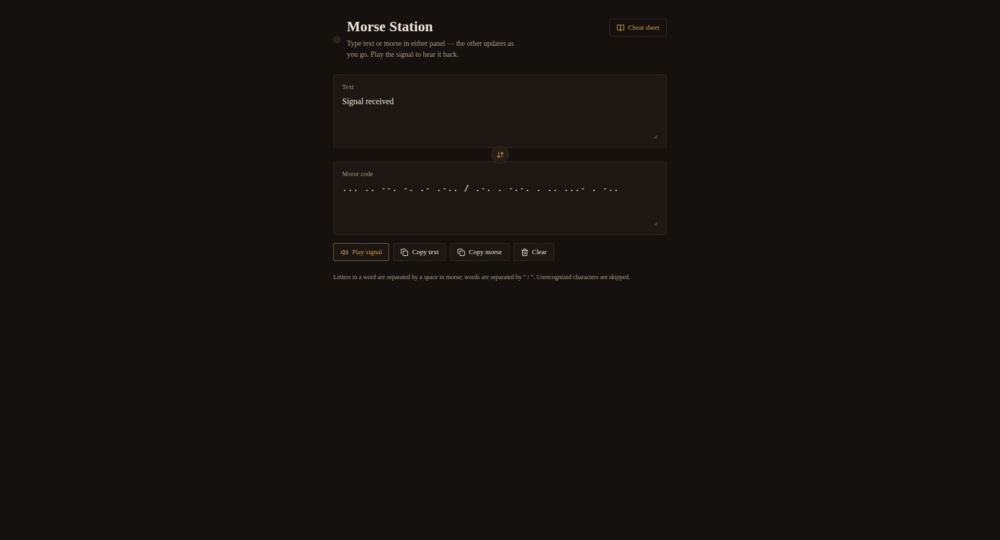

# Morse Station


A fast, interactive Morse code translator that works both ways in real time. Type text to generate Morse code, or enter Morse code to decode it instantly. Both panels stay perfectly in sync, with accurate audio playback and a built-in reference guide.

**Live Demo:** https://morsestation.vercel.app



---

## Features

* **Real-time translation** — Edit either text or Morse input and see instant updates.
* **Accurate audio playback** — Hear Morse code as timed tones (dots, dashes, and gaps) following standard ratios, with a synchronized visual indicator.
* **Built-in cheat sheet** — Slide-in panel covering letters, numbers, and punctuation.
* **Copy with one click** — Quickly copy text or Morse output.
* **Full punctuation support** — Includes `. , ? ' ! / ( ) & : ; = + - _ " $ @`.

---

## Tech Stack

* React 18
* Vite — development server and build tool
* lucide-react — icons
* Plain CSS for styling (no framework)

---

## Getting Started

### Install dependencies

```bash
npm install
```

### Run locally

```bash
npm run dev
```

Starts a development server (usually at `http://localhost:5173`).

### Build for production

```bash
npm run build
npm run preview
```

---


---

## Project Structure

```
morse-station/
├── index.html
├── package.json
├── vite.config.js
├── src/
│   ├── main.jsx
│   ├── App.jsx
│   └── index.css
└── README.md
```

---

## How It Works

* **Encoding:** Converts text to uppercase, maps each character to Morse, separates letters with spaces and words with `" / "`.
* **Decoding:** Splits Morse by `" / "` for words and spaces for characters, then maps each sequence back to text.
* **Error handling:** Unsupported characters are ignored gracefully.

---

## License

MIT License — free to use, modify, and distribute.

